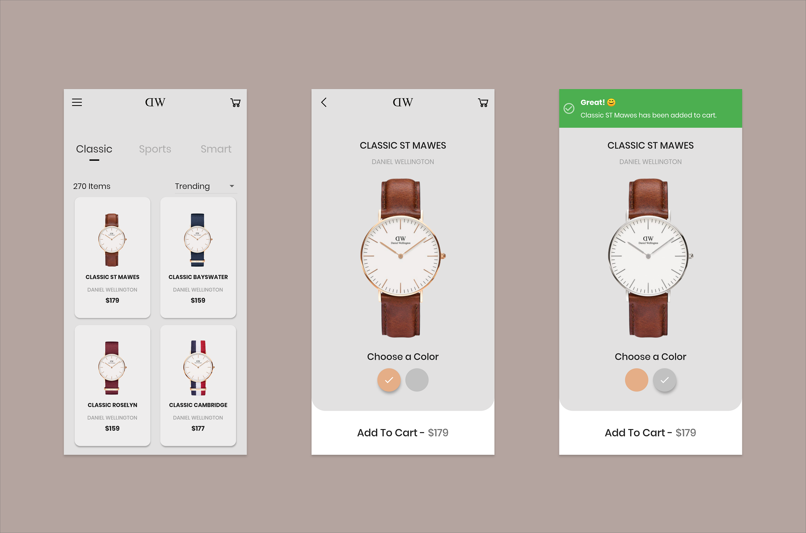
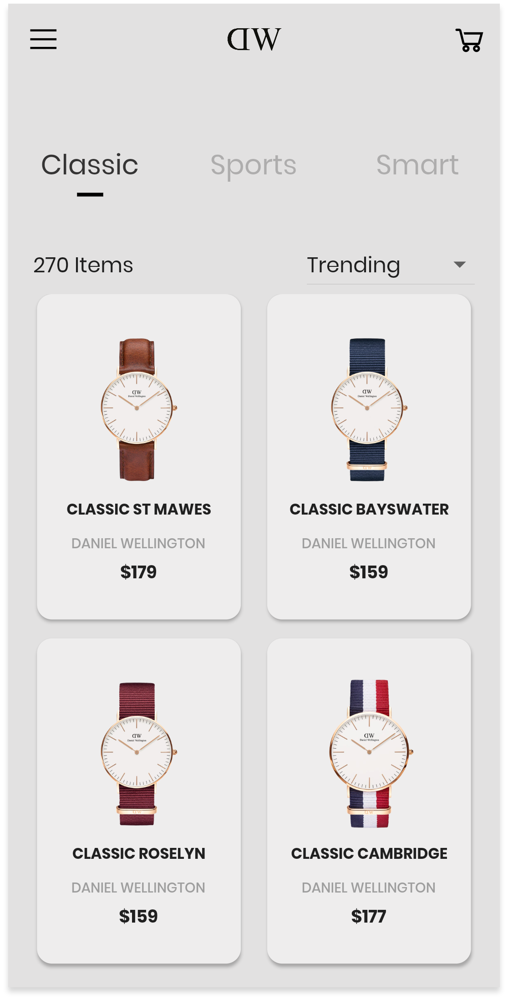
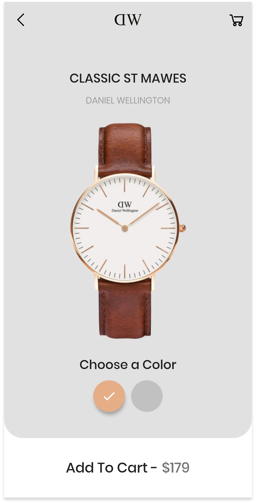
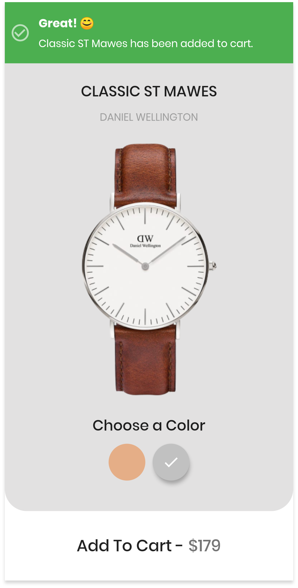

# Flutter Quick UI  -  Watch Shop

A Flutter UI implementation of a Watch Shop App inspired by <a href="https://dribbble.com/hafizrana">Hafiz Rana's</a> desgin on <a href="https://dribbble.com/shots/8088100-Mobile-app-Watch-Shop">Dribble</a>.

Star this repo if you like what you see.

## 📸 Screenshots

  

## Author(s)
**Emmanuel Fache**

## Getting Started

**Note**: Make sure your Flutter environment is setup.
#### Installation

In the command terminal, run the following commands:

    $ git clone https://github.com/emrade/flutter-watch-shop-ui.git flutter_watch_shop
    $ cd flutter_watch_shop/
    $ flutter packages get
    $ flutter run

##### Check out Flutter’s online [documentation](http://flutter.io/) for help getting started with your Flutter project.
